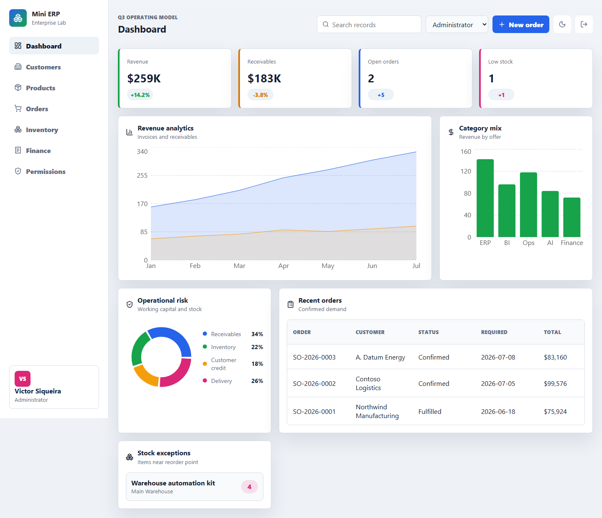
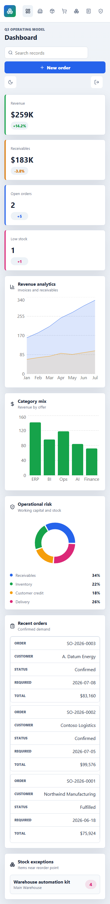
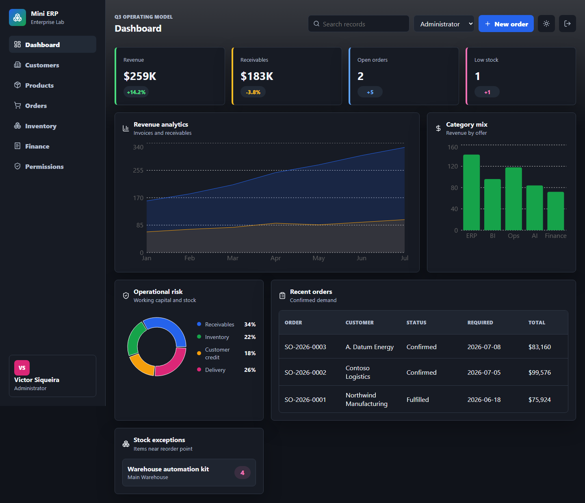

# Mini ERP


A full stack portfolio ERP platform built with .NET, React, TypeScript, PostgreSQL and Docker.

The project models realistic enterprise software workflows: authentication, role-based access, customers, products, sales orders, inventory reservations, invoices, finance operations and executive analytics. The React UI calls the ASP.NET Core API through `/api` and keeps a deterministic fallback dataset for reliable demos when the backend is offline. All data is fictitious and safe for public portfolio use.

## Preview



| Mobile | Dark mode |
| --- | --- |
|  |  |

## Architecture

```text
mini-erp/
  backend/
    src/MiniErp.Api/          ASP.NET Core API, EF Core, JWT, RBAC
    tests/MiniErp.Api.Tests/  Service and business rule tests
  frontend/                   React, TypeScript, Recharts, Vitest
  docker-compose.yml          PostgreSQL, API and frontend runtime
```

## Features

- JWT authentication with demo users and role claims.
- RBAC policies for Administrator, Manager and Analyst access.
- React frontend integrated with the API, with deterministic fallback for offline demos.
- Customer portfolio with status control.
- Product catalog with inventory positions.
- Sales order creation with stock reservation.
- Invoice generation and finance settlement flow.
- Dashboard with revenue, receivables, stock risk and recent orders.
- PostgreSQL persistence through EF Core.
- Docker Compose environment for local full stack execution.
- Automated tests for backend services and frontend workflows.
- GitHub Actions CI for backend, frontend and vulnerability audit.

## What This Demonstrates

- Full stack enterprise application structure across API, persistence and UI.
- Domain workflows for order creation, stock reservation and invoice settlement.
- Security boundaries through JWT authentication and RBAC policies.
- Public portfolio design using fictitious ERP data instead of client code.

## Demo Accounts

All demo accounts use `enterprise-demo`.

| User | Role |
| --- | --- |
| victor.siqueira@enterprise.dev | Administrator |
| marina.costa@enterprise.dev | Manager |
| rafael.lima@enterprise.dev | Analyst |

## Local Development

Backend:

```bash
cd backend
dotnet restore MiniErp.slnx
dotnet run --project src/MiniErp.Api
```

Frontend:

```bash
cd frontend
npm install
npm run dev
```

Docker:

```bash
docker compose up --build
```

Default URLs:

- Frontend: `http://localhost:5174`
- API: `http://localhost:5080`
- PostgreSQL: `localhost:5432`

## Quality Gates

Backend:

```bash
cd backend
dotnet build MiniErp.slnx
dotnet test MiniErp.slnx
dotnet list MiniErp.slnx package --vulnerable --include-transitive
```

Frontend:

```bash
cd frontend
npm run lint
npm run build
npm test
npm run test:visual
```

## API Surface

Main endpoints:

| Method | Path | Purpose |
| --- | --- | --- |
| POST | `/api/auth/login` | Issue JWT for a demo user |
| GET | `/api/dashboard` | Dashboard metrics and charts |
| GET/POST | `/api/customers` | Customer portfolio |
| PATCH | `/api/customers/{id}/status` | Customer lifecycle |
| GET/POST | `/api/products` | Product catalog |
| GET/POST | `/api/orders` | Sales orders and reservations |
| GET | `/api/inventory` | Inventory positions |
| POST | `/api/inventory/adjustments` | Stock adjustments |
| GET | `/api/finance/invoices` | Invoice portfolio |
| POST | `/api/finance/invoices/{id}/mark-paid` | Finance settlement |

## Portfolio Intent

This repository demonstrates how an enterprise engineer structures a public full stack business platform without exposing client code: domain modeling, API boundaries, persistence, authentication, UI workflows, tests, Docker and CI.
